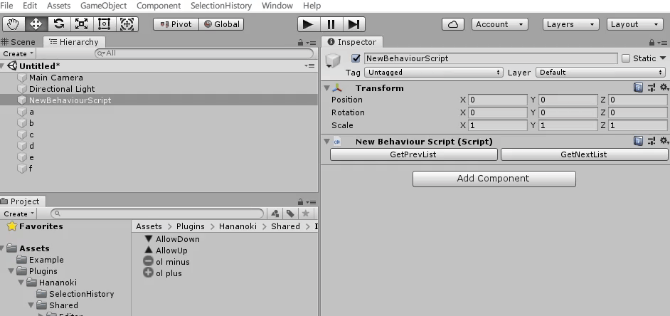

# SelectionHistory

[Japanese](https://translate.google.com/translate?sl=en&tl=ja&u=https://github.com/hananoki/SelectionHistory) (by Google Translate)

## Overview
- Implementation of object selection history for embedded

## Licence

[NYSL](https://github.com/hananoki/SelectionHistory/blob/master/LICENSE.md)